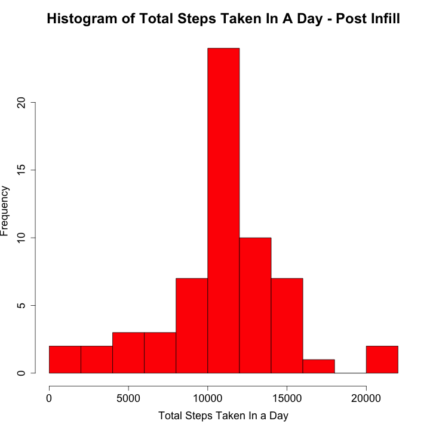

## Loading and preprocessing the data
Load libraries  
Set some options for displaying numbers  
Set working directory, check for data directory and create if necessary, then unzip data file  
```{r,echo=TRUE}
library(ggplot2)
library(png)
library(knitr)
options(digits=5, scipen=10000)
if (!file.exists("data")) {
  dir.create("data")
}
unzip("./activity.zip", exdir="./data")
activity <- read.csv("./data/activity.csv")
````
Display some basic information about the dataset
```{r}
str(activity)
head(activity)
tail(activity)
```
## What is mean total number of steps taken per day?
Calculate mean steps per day using aggregate function  
First need to convert date to POSIXct format
```{r, warning=FALSE}
activity$date <- as.POSIXct(activity$date, "%Y-%m-%d")
stepsperday <- aggregate(steps ~ date, activity, FUN=sum, na.rm=TRUE)
````
Create a histogram of the total number of steps in a day
```{r, results="hide"}
png("./figures/figure1.png", width=720, height=720)
hist(stepsperday$steps, xlab="Total Steps Taken In a Day", main="Histogram of Total Steps Taken In A Day", breaks=10, col="red", cex.lab=1.5, cex.axis=1.5, cex.main=2 )
dev.off()
```
```{r}
include_graphics("./figures/figure1.png")

```
  
Report the mean number of steps in a day  
```{r}
mean_orig <- mean(stepsperday$steps)
mean_orig
```
Report the median steps in a day  
```{r}
median_orig <- as.numeric(median(stepsperday$steps))
median_orig
```
## What is the average daily activity pattern?
Calculate the average daily activity pattern, again using aggregate
```{r}
stepsperinterval <- aggregate(steps ~ interval, activity, FUN=mean, na.rm=TRUE)
```
Create a line plot of the average number of steps per 5 minute interval
```{r, results="hide"}
png("./figures/figure2.png", width=720, height=720)
with(stepsperinterval,plot(steps ~ interval, type="l", col="red", lwd=2, xlab="Interval", ylab="Steps", main="Average Steps Taken Per Interval", cex.lab=1.5, cex.axis=1.5, cex.main=2))
dev.off()
```
```{r}
include_graphics("./figures/figure2.png")
```
  
Show the 5 minute interval across all days that has the highest number of steps  
```{r}
max_steps <- stepsperinterval[which.max(stepsperinterval$steps),]
max_steps
```
## Imputing missing values
There are a number of intervals where no measurments are available, indicated indicated by NA in the steps column.  
We will fill these values with the average number of steps in that interval for the whole dataset, as calculated above  
  
First calculate total number of missing values
```{r}
tot_val <-nrow(activity)
tot_missing <- sum(is.na(activity$steps))
pcnt_missing <- (tot_missing / tot_val)*100
```
The total number of measurements is `r tot_val`  
The number of missing measurement is `r tot_missing`  
The percentage of missing measurements is `r pcnt_missing`%  
  
We now fill in the missing measurements with the mean for that interval calculated for the entire dataset  
```{r}
activity_fill <- transform(activity, steps=ifelse(is.na(activity$steps), yes=stepsperinterval$steps, no=activity$steps))
```
Check that we have no missing values
```{r}
sum(is.na(activity_fill$steps))
```
Now we create a histogram of the total steps per day after imputing the missing values  
```{r, results="hide", warning=FALSE}
stepsperdayfill <- aggregate(steps ~ date, activity_fill, FUN=sum, na.rm=TRUE)
png("./figures/figure3.png", width=720, height=720)
hist(stepsperdayfill$steps, xlab="Total Steps Taken In a Day", main="Histogram of Total Steps Taken In A Day - Post Infill", breaks=10, col="red", cex.lab=1.5, cex.axis=1.5, cex.main=2)
dev.off()
```
```{r}

```
  
We now re-calculate the mean and median values of steps per day and compare to original values  
```{r}
mean_fill <- mean(stepsperdayfill$steps)
median_fill <- median(stepsperdayfill$steps)
```

The original (pre-imputing) mean steps per day was `r mean_orig`  
The post imputing mean steps per day is `r mean_fill`   
The original (pre-imputing) median steps per day is `r median_orig`  
The post imputing median steps per day is `r median_fill`  

## Are there differences in activity patterns between weekdays and weekends?
Calculate weekday and then add a daytype column to activity dataframe to identify days belonging to weekday or weekend  
```{r, warning=FALSE}
activity$weekday <- weekdays(activity$date)
activity$daytype <- factor(ifelse(activity$weekday %in% c("Saturday", "Sunday"), "weekend", "weekday"))
head(activity)
tail(activity)
```
Calculate average steps taken in each 5 mintue interval for weekend days and week days  
```{r}
stepsperintervalpertype <- aggregate(steps ~ interval + daytype, activity, FUN=mean, na.rm=TRUE)
```
Now create the panel plot using facets on the newly created daytype factor to differentiate between panels  
```{r}
ggplot(stepsperintervalpertype, aes(x=interval, y=steps)) +
geom_line(colour="lightblue") +
labs(x="Interval", y="Number of steps") +
facet_wrap(~daytype , ncol=1, nrow=2) +
theme_bw ()
ggsave("./figures/figure4.png")

```
**This concludes the assignment**


